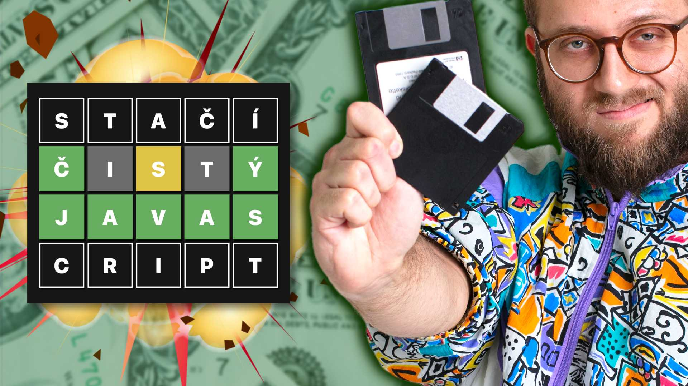

# Sprav si MILIÓNOVÚ hru v JavaScripte (naučím ťa!)
### slovka.sk 🇸🇰 klon wordle 

Naučím ťa spraviť hru. Vysvetlím každý krok. Nepotrebuješ engine, framework, ani iné veľké slovo. 
Stačí ti internetový prehliadač a textový editor.
Ak nie si programátor, naučím ťa byť. A potom zhodnotíš, či to bola chyba.

**Sleduj ma, ako od nuly [vytvorím slovenský klon Wordle](https://slovka.sk). V čistom JavaScripte.**
Wordle je hra, ktorú nedávno The New York Times kúpilo za milióny dolárov.
Predá sa naša hra a budeme všetci bohatí? NIE! Ale keď chceš niečo zdieľať na internete, musíš nájsť hook.  

Napríklad, že ťa od základov naučím naprogramovať hru, ktorá zarobila milióny.
Všetko, čo potrebuješ, už máš v počítači. A stíhame to za 2 hodiny. Aj kúsok. Poď ✨

---

### VIDEO, kde ťa naučím hru spraviť, krok za krokom:
  
:: https://youtu.be/x-KXrkrM9D4

  
### ZAHRAJ SA, uhádni slovo (žiadne množné čísla, slovesá, prídavné mená)
  
:: https://slovka.sk

V branchoch vidíš, ako sa kód vyvíjal.

---

Ak si učiteľ, môžeš tento kód a video používať na škole, ako len chceš. Enjoy!  
Ak ma chceš podporiť, a nemusíš byť učiteľ, **hoď po mne groš cez ♥️ [patreon](https://www.patreon.com/yablko)**.  
Sľubujem, že to možno nie je kult a patróni majú moje videá a kurzy skôr. A môžu mi kydať do vecí. A dávam im tipy, rady, odporúčania, backstage veci a spomínal som, že to možno nie je kult? 

---

### KURZY, ktoré spomínam vo videu (trochu si spravím reklamu)
  
HTML a CSS od základov https://youtu.be/LULd0858mUQ  
WEBREBEL kurz tu https://www.learn2code.sk/kurzy/webrebel-1-html-css-javascript  
Skús webrebel ZDARMA https://www.youtube.com/playlist?list=PL3VwAXKvhemVw5DnAqeGbZx5AgEQT27xF  
JavaScript a ES6 kurz https://www.learn2code.sk/kurzy/online-kurz-javascript-es  
Základy programovania a OOP kurz https://www.learn2code.sk/kurzy/zaklady-programovania-a-oop  
Všetky moje learn2code kurzy https://www.learn2code.sk/instruktori/roman-hraska 1300+ videí  
Predplatné (dostaneš všetko, čo existuje) https://www.learn2code.sk/predplatne  
Tu nájdeš kopu ukážok z mojich kurzov, skús si ich ZDARMA https://www.youtube.com/c/Yablko/playlists?view=1&sort=dd&shelf_id=0

---

### Chceš sa zlepšiť v programovaní?  

Chyť môj kód a vylepši.  
Pár nápadov, čo s ním môžeš spraviť:  
  
**a) KLÁVESNICA + MOBILE**
  
Kód musí fungovať aj na mobiloch.    
Väčšina toho je hotová. Zvyšok dokonči.   
  
**b) animationend**  
  
Prerob judgeResult() na animationend.    
Vo videu poviem prečo. A poviem to aj tu: je to lepšie.    
  
**c) FARBOSLEPÝ REŽIM**  
  
Nie každý jasne vidí rozdiel medzi týmito farbami.  
Pridaj farboslepý režim.  
Nech každý môže hrať komfortne.  
    
**d) RIEŠENIE ZA BOARDOM**  
  
Keď board vypadne, odhalí sa riešenie.  
Ako keby celý čas svietilo za ním.  
  
**e) ŠTATISTIKY**  
  
Toto je pokročilé. Meraj koľko pokusov človek potreboval.  
Meraj streak. Že koľko správne trafil po sebe.  
Meraj percentuálnu úspešnosť.  
Meraj čas, ako dlho trvalo riešenie.  
  
**f) RAZ DENNE**  
  
Wordle každý deň vyberie jedno slovo.  
Môžeš hádať len raz denne.  
Sprav to!  
  
**g) FRAMEWORK**  
  
Prerob to do Vue.js, Svelte, Reactu.   
Prerob to do čohokoľvek, čo sa chceš naučiť.  
Ja to robím, keď sa učím niečo nové.  
Skúsim v tom vyrobiť skutočnú vec.  

**h) ANIMÁCIA**  

Nech sa použité písmená dole v klávesnici vyznačia až po skončení animácie.  
Teraz bliknú hneď na farbu, už pocaš toho, ako sa písmená hore otáčajú.  

**i) UKLADAJ SLOVÁ**  

Teoreticky sa môže stať, že hra vyberie po sebe to isté slová.  
Ukladaj slová, ktoré už boli použité.  
Aby sa vždy vyberali nové a nové slová.  
  
♥️
